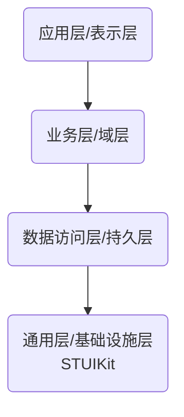

# STUIKit

#用途：iOS UIKit 组件相关的扩展库

#语言：swift、objc

#描述：基于 UIKit 实现相关扩展支持，包含如下：
1. 控件：
   包含按钮（UIButton）、标签（UILabel）、文本输入框（UITextField），以及更多的 UI 元素，用于构建交云用户界面。
2. 视图和视图控制器：
   提供视图（UIView）和视图控制器（UIViewController）类以及它们的子类，用于管理应用程序的视图层次结构和事件响应。
3. 触摸和手势处理：
   支持触摸（UITouch）事件以及各种手势识别（UIGestureRecognizer），比如点击、滑动、捏合、旋转等。
4. 图像和动画：
   包含处理图像（UIImage）和动画（UIView.animate(withDuration:animations:)）的类和界面。
5. 布局：
   提供自动布局（Auto Layout）工具，使用约束系统来定义用户界面的布局，使界面能够适应不同的屏幕尺寸和方向。
6. 导航：
   包含导航控制器（UINavigationController），允许容易地在视图控制器之间进行层次化的导航。
7. 分栏视图：
   对于更复杂的用户界面，如在 iPad 上，UIKit 提供了分栏视图控制器（UISplitViewController）来支持主/详情布局。
8. 表格视图和集合视图：
   表格视图（UITableView）和集合视图（UICollectionView）用于管理大量可滚动内容的展示。
9. 弹出和警告：
   提供弹出框（UIAlertController）来显示通知、警告或从底部菜单进行选择。
10. 转场和呈现：
   管理视图控制器转场（UIViewControllerAnimatedTransitioning）和全屏或部分屏幕内容呈现（UIPresentationController）。

#Pod 依赖关系：作为通用层的基础组件，应尽量减少其他自定义仓库的依赖关系

